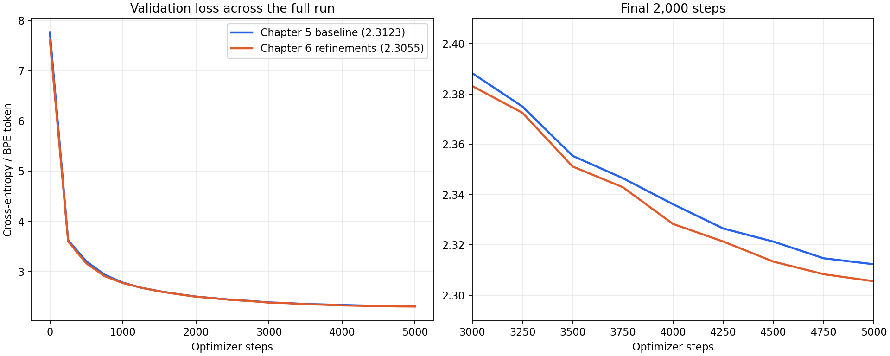
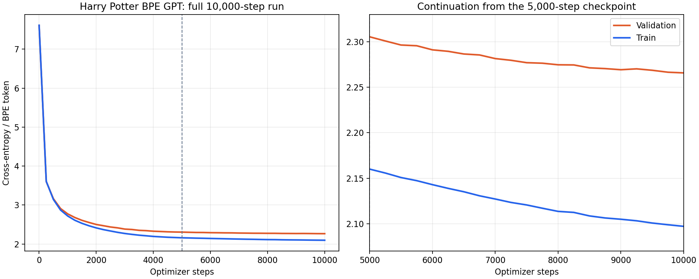

# Project 6: From Prototype to nanoGPT

> Two surgical refinements that turn the Project 5 prototype into a production-shape model: parameter groups for weight decay, and scaled residual initialization. Train both side-by-side and watch val loss drop by 0.7.

## Hook

By this point you have a working tiny GPT. The next question is whether reading reference code like nanoGPT is admiration or theft. Most lines in nanoGPT are not new algorithms. They are sharper engineering choices — different optimizer setup, different init, different data path. This project picks two of those choices, applies them to the Project 5 prototype, and measures the difference.

## The Concept

Most of the surface area between "a working prototype" and "a production-shape reference implementation" lives in three categories:

1. **True algorithmic necessities** — without these, the model doesn't train (residuals, LayerNorm). Project 5 already has these.
2. **Engineering choices that change speed, clarity, robustness** — what this project demonstrates.
3. **Pure style** — naming, file organization.

We apply two refinements from category 2:

- **Parameter groups for weight decay.** AdamW applies weight decay uniformly by default. But biases and LayerNorm parameters serve a different role from weight matrices — they calibrate scale and shift, they don't carry the learned content. Shrinking them is at best wasted and at worst harmful. Split parameters into two groups: weights get `weight_decay=0.1`, biases and LayerNorm get `weight_decay=0.0`.

- **Scaled residual initialization.** In a deep residual stack, each block adds its output to the running hidden state. If each addition is full-scale, the magnitude drifts upward layer by layer. Compensate by initializing the residual-path output projections (attention.proj and the second linear in the MLP) with std reduced by `1/sqrt(2 * n_layers)`. Other linears and embeddings get `std=0.02`.

### Why AdamW?

Adam uses running averages of each parameter's gradient and squared gradient to choose adaptive update sizes. AdamW keeps that adaptive update, but applies **weight decay as a separate shrinkage of the parameter**, rather than mixing the decay term into the gradient that Adam rescales. In shorthand, after computing Adam's loss-driven update, the parameter is also multiplied by `1 - learning_rate × weight_decay`. For example, with learning rate `3e-4` and decay `0.1`, that factor is `0.99997` per update—not a 10% reduction per step. This makes the strength of the shrinkage easier to control independently of Adam's gradient statistics; it can help regularize large weight matrices, but does not guarantee a lower validation loss. See the [PyTorch AdamW documentation](https://docs.pytorch.org/docs/stable/generated/torch.optim.AdamW.html) and the [original AdamW paper](https://arxiv.org/abs/1711.05101).

Our Project 5 A100 baseline **already used AdamW**, with PyTorch's default decay of `0.01` on every parameter. Chapter 6 changed *which parameters decay and by how much*: weight matrices get `0.1`, while biases and LayerNorm parameters get `0`. It also changed residual initialization. Therefore our measured validation difference is not an AdamW-versus-Adam test, and it cannot isolate the effect of decay groups from initialization.

## Why It Matters

After Project 6 you should not admire reference code from a distance. You should steal from it selectively, because you know what each stolen part is protecting.

---

## What Got Built

A side-by-side training script comparing the Project 5 prototype's defaults against nanoGPT-style refinements.

### Files in this folder

| File | What it is |
|------|------------|
| [`build.py`](build.py) | Imports the GPT class from Project 5; adds `init_weights()`, `configure_param_groups()`, `train_with_groups()`; trains both side-by-side |
| `break_it.py` | Raw extracted from the chapter — kept for reference (this project's "break vs. fix" comparison lives in build.py itself) |
| `step_*.py` | The book's code blocks, extracted step-by-step. Reference material. |
| `tests/test_unit.py` | 8 unit tests: param groups split correctly, biases + LN go to no-decay, weight-tied params not double-counted, init std values are correct, refinements help on val loss |

### How to run

```bash
python build.py --tiny      # 300 steps, ~5s on CPU
python build.py --full      # 5000 steps
pytest projects/06_from-prototype-to-nanogpt/
```

---

## Outputs (from `python build.py --tiny`)

4-layer model, d_model=64, 4 heads, 300 training steps:

```
Uniform baseline: 3.8712

mode                               final train     final val
------------------------------------------------------------
prototype (P5 defaults)                 0.5342        4.3250
nanoGPT-style refinements               0.4460        3.6184

Parameter groups in nanoGPT-style optimizer:
  with weight_decay=0.1:  201728 params
  with weight_decay=0.0:  3456 params (biases + LayerNorm)
```

Two things to notice:

1. **The prototype's val loss (4.33) is WORSE than uniform (3.87).** With no weight decay and default init, the model overfits hard — it learned the training set so aggressively that val performance degraded *below* random. This is exactly the failure the chapter warns about.

2. **nanoGPT-style val loss (3.62) is 0.7 lower** despite slightly better train loss. Weight decay on the right parameters + smaller residual init keeps the model from collapsing into memorization.

### Side-by-side loss curves


The two train curves are similar (both drop hard). The two val curves are not: the prototype's val starts rising sharply (overfit signature) while the nanoGPT-style val keeps decreasing.

### Our Harry Potter BPE model on A100

We also applied both refinements to the larger, 2048-token BPE model from Project 5. The implementation is in [`my_gpt.py`](../05_your-gpt-from-a-blank-file/my_gpt.py) (`init_scaled_residual_projections` and `configure_decay_groups`), and [`modal_gpt_a100.py`](../05_your-gpt-from-a-blank-file/modal_gpt_a100.py) selects the `chapter6` variant. This run starts with fresh weights because initialization cannot be retroactively applied to an already-trained checkpoint. The tokenizer, train/validation split, model dimensions, 5,000-step learning-rate schedule, evaluation batches, and generation prompts match the earlier A100 run.

| A100 run | Final train loss | Final validation loss |
|---|---:|---:|
| Project 5 baseline | 2.1644 | 2.3123 |
| Chapter 6 refinements | 2.1600 | 2.3055 |
| Chapter 6, continued to 10,000 steps | 2.0971 | 2.2658 |

The baseline used PyTorch AdamW's default `weight_decay=0.01` on every parameter. The Chapter 6 run uses `0.1` for weight matrices and `0.0` for biases and LayerNorm, plus scaled residual projections. Validation loss improved by 0.0068 nats per BPE token. This is a small gain, unlike the 0.7 gain in the separate tiny character-level exercise above; the two refinements were changed together, so this comparison cannot attribute the gain to either one alone. Generated text still has sentence-level inconsistencies.



The 10,000-step result resumes the Chapter 6 checkpoint at step 5,000 using [`modal_gpt_continue.py`](../05_your-gpt-from-a-blank-file/modal_gpt_continue.py). It restores model weights, AdamW moments, and sampling RNG state, then runs 5,000 more updates while cosine-decaying the learning rate from `3e-5` to `1e-5`. The resumed checkpoint reproduced the step-5,000 validation loss exactly. Validation improved another 0.0397 nats per BPE token, although the train/validation gap grew and the fixed-prompt samples still contain broken grammar and scene logic. The next gains in text quality likely need more than simply extending this low-learning-rate run.



### What Karpathy's nanochat adds beyond our toy GPT

Our model already has BPE, causal attention, residual blocks, AdamW, a learning-rate schedule, validation, checkpoint/resume, and next-token generation. Karpathy's current [nanochat repository](https://github.com/karpathy/nanochat) extends that into a larger, faster, end-to-end chat-model pipeline:

| Area | Our Harry Potter GPT | Additional nanochat code |
|---|---|---|
| Data | Seven books and a small, homemade BPE tokenizer | Pretraining data preparation, tokenization and distributed loading |
| Architecture | Learned position embeddings, LayerNorm, ordinary multi-head attention, GELU, tied token/output weights | In the current [`gpt.py`](https://github.com/karpathy/nanochat/blob/master/nanochat/gpt.py): rotary positions, RMSNorm, QK normalization, grouped-query attention, faster attention kernels, ReLU-squared MLP, and untied token/output weights |
| Training and evaluation | One A100, AdamW groups, loss curves and checkpoints | Distributed training, a Muon+AdamW optimizer, throughput measurement, bits-per-byte and task evaluations |
| Inference | `generate()` recomputes the context for each new token | [`engine.py`](https://github.com/karpathy/nanochat/blob/master/nanochat/engine.py) uses a KV cache to reuse earlier attention work |
| Chat behavior | Next-token pretraining on books | [`chat_sft.py`](https://github.com/karpathy/nanochat/blob/master/scripts/chat_sft.py) and [`chat_rl.py`](https://github.com/karpathy/nanochat/blob/master/scripts/chat_rl.py) add post-training on conversation and tasks, with a chat CLI |

The key distinction is **base LM versus assistant**. Our Harry Potter model learned to continue text; it was never taught to follow a user's instruction or answer in a chat format. Nanochat includes those later training stages. Architecture and inference improvements can make a model scale or run faster, but simply copying one of them would not turn our small book-trained model into a capable assistant. The [nanochat README](https://github.com/karpathy/nanochat#file-structure) maps the whole pipeline.

### What the parameter-group split actually catches

In a model of this size (≈200k decayed weights, ≈3k undecayed), the 3k undecayed parameters are:

- 4 layers × 2 LayerNorm modules per block × 2 params per LayerNorm (weight + bias) = 16 LN params per layer
- Plus the final LayerNorm
- Plus all the Linear biases (qkv, proj, mlp.0, mlp.2 across 4 blocks)
- Plus the LM head bias (wait — we used `bias=False` for lm_head, so it's not here)

Most of the parameter count is in the weight matrices. But the 1.5% of params that *aren't* weights have a substantively different role, and the optimizer should respect that.

---

## "BREAK IT" — this project IS the comparison

Project 6 doesn't have a separate `break_it.py` exercise because the comparison **is** the break-vs-fix experiment. Running `build.py` trains both versions side by side. The "broken" baseline is the unrefined Project 5 defaults. The "fixed" version applies the two refinements together. The val-loss delta (0.7 nats lower) is what the refinements buy you.

If you want a more targeted break: edit `configure_param_groups` to put everything in the same group with full weight decay, retrain, and watch the LayerNorm weights collapse toward zero. That's the lesson that "different parameters play different roles, so the optimizer should treat them differently."

---

## Read in the book

This project is Chapter 6 of *Under the Hood: Build Every Layer of a Large Language Model from Scratch*. Buy the book at <https://leanpub.com/under-the-hood>.

Read the chapter for: the full "categories of differences" framework, the fused-QKV-projection performance walkthrough, the data-path optimization story about a starving GPU, the LR warmup/cosine derivation, and the comparison of mixed-precision and FSDP across the two implementations.
