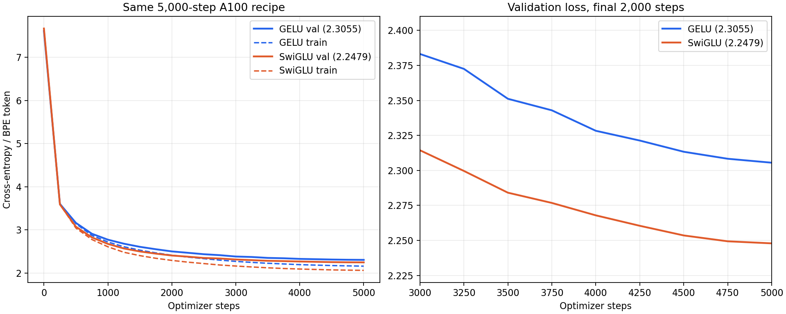
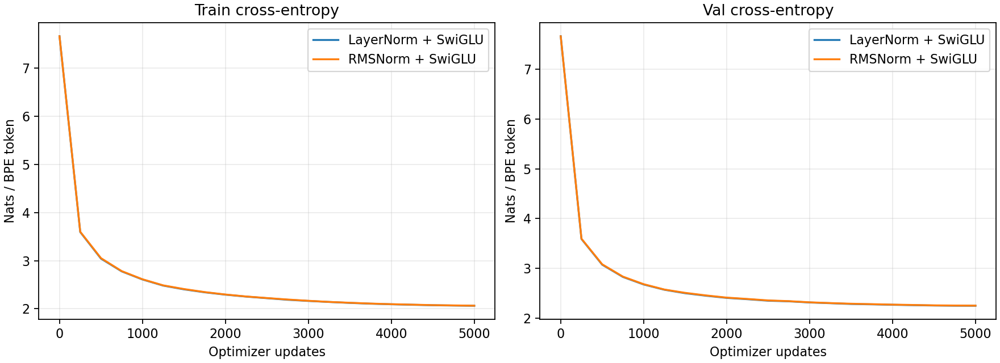
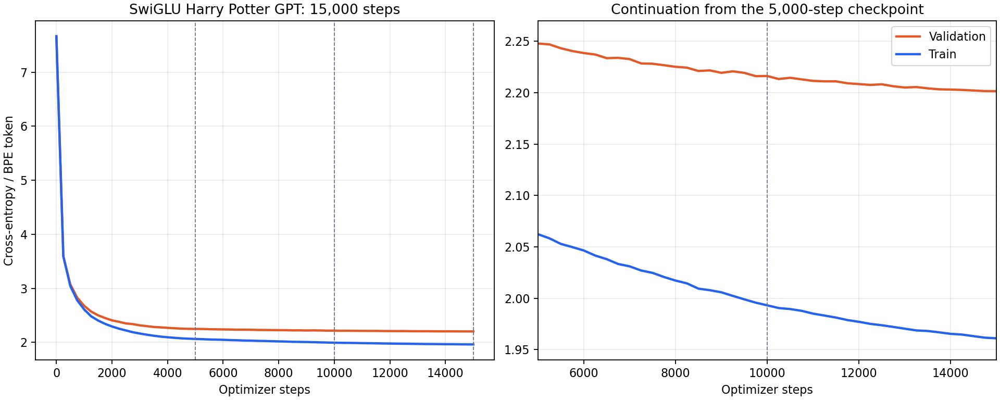
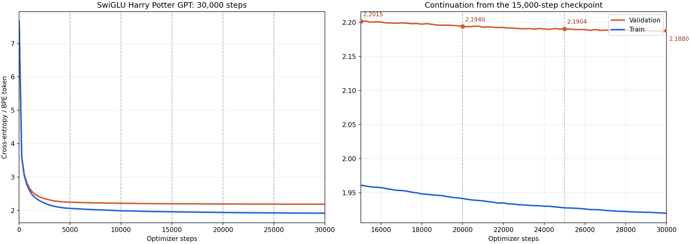
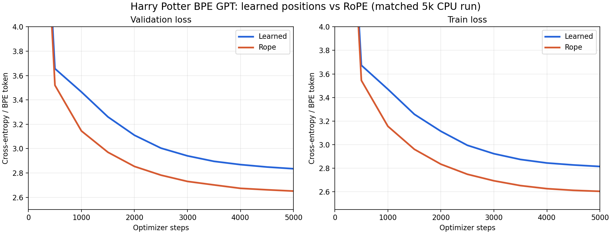

# Project 7: The Details That Matter

> RMSNorm instead of LayerNorm. SwiGLU instead of GELU. The two architectural swaps that appear in Llama, Mistral, and most modern open-weight LLMs. Train all four combinations side-by-side and look at the deltas.

## Hook

By the time you have read three different open-weight LLM codebases you start noticing that they all dropped vanilla LayerNorm + GELU somewhere between 2022 and 2024. RMSNorm and SwiGLU are the standard replacements. This project implements both, trains all four `{LN, RMS} × {GELU, SwiGLU}` combinations against the same data, and reports the comparison.

## The Concept

- **RMSNorm.** LayerNorm computes mean and variance, then normalizes. RMSNorm drops mean-centering and divides by root-mean-square: `x / sqrt(mean(x²) + eps)`. It still controls vector magnitude, with a simpler formula. Actual speed depends on the GPU kernel implementation.
- **SwiGLU.** Standard MLP: `x → Linear → GELU → Linear`. SwiGLU adds a gating term: `(silu(x @ W_gate) * (x @ W_up)) @ W_down`. The gating multiplies the projected representation by a learned mask — features get scaled by their own activation, which makes the MLP more expressive without changing parameter count much (we set hidden_mult=8/3 to keep counts roughly equal to the GELU MLP).

## Why It Matters

These are not algorithmic breakthroughs. They are incremental refinements that win on the margins. Reading reference implementations of modern models without knowing what's underneath these names is reading code with two unexplained imports.

---

## What Got Built

A single script that defines `RMSNorm`, `SwiGLU`, and a `ModernGPT` with configurable norm + MLP. Trains all four combinations and reports.

### Files in this folder

| File | What it is |
|------|------------|
| [`build.py`](build.py) | `RMSNorm`, `SwiGLU`, `ModernGPT` with config switches; trains 4 variants |
| [`experiment_rope_cpu.py`](experiment_rope_cpu.py) | Matched learned-position vs. RoPE GPT training on Harry Potter BPE |
| `step_*.py` | The book's code blocks, extracted step-by-step. Reference material. |
| `tests/test_unit.py` | 7 tests: RMSNorm produces unit-RMS output, SwiGLU shape, ModernGPT forward, all 4 variants train |
| [`tests/test_rope_my_gpt.py`](tests/test_rope_my_gpt.py) | RoPE rotation, relative-position, causal-mask, and checkpoint-compatibility checks |

### How to run

```bash
python build.py --tiny      # 200 steps each = 4 quick trainings, ~30s on CPU
python build.py --full      # 2000 steps each
pytest projects/07_the-details-that-matter/
```

---

## Outputs (from `python build.py --tiny`)

200 training steps × 4 variants × ~25k params each:

```
norm    mlp           params     train       val
--------------------------------------------------
ln      gelu          105216    1.5537    2.6379
rms     gelu          104896    1.5506    2.5884
ln      swiglu        104320    1.5969    2.5978
rms     swiglu        104000    1.6135    2.5991

Uniform baseline: 3.8712
```

### Reading the table

- All four variants train comfortably below uniform (3.87).
- RMS + GELU edges out LN + GELU by 0.05 nats on val. RMSNorm is mostly a "same quality, less work" swap.
- SwiGLU variants slightly raise train loss but reduce val loss vs. plain LN+GELU — small regularizing effect at this scale.
- The deltas here are **modest** (~0.05 nats). On a tiny 1.8 KB corpus you should not expect dramatic differences. At pretraining scale, the simpler RMSNorm calculation can be attractive when efficiently implemented, and SwiGLU's gated MLP can help model quality. Neither swap guarantees a win in every implementation.

The lesson: these refinements are useful architectural choices, but quality and throughput must be measured separately on the target implementation.

### Our Harry Potter BPE A100 comparison

We added a configurable SwiGLU MLP to our [`my_gpt.py`](../05_your-gpt-from-a-blank-file/my_gpt.py) and a `chapter7_swiglu` variant to the [`Modal A100 script`](../05_your-gpt-from-a-blank-file/modal_gpt_a100.py). This comparison keeps **LayerNorm**, the Chapter 6 residual initialization and AdamW parameter groups, the 2,048-token BPE data, the 5,000-step schedule, and the fixed validation windows. Only the MLP recipe changes: GELU's `d → 4d → d` becomes a gated `d → 8d/3` SwiGLU with three projections. The new MLP has almost the same parameter count, and both models train from fresh weights.

| Variant | Parameters | Step-5,000 train loss | Step-5,000 val loss |
|---|---:|---:|---:|
| LayerNorm + GELU | 3,716,608 | 2.1600 | 2.3055 |
| LayerNorm + SwiGLU | 3,709,440 | 2.0623 | 2.2479 |

SwiGLU improved validation loss by **0.0576 nats per BPE token** in this single-seed comparison. The curves separate early and remain apart, though this one experiment does not establish how consistently the advantage repeats across seeds. Fixed-prompt generated text is still grammatically and logically inconsistent; the lower next-token loss did not turn this small book-trained model into a coherent storyteller. The prior 10,000-step GELU result (2.2658) is useful context but not a matched-step comparison.



### LayerNorm versus RMSNorm in our Harry Potter GPT

We added `norm_type="rmsnorm"` to [`my_gpt.py`](../05_your-gpt-from-a-blank-file/my_gpt.py), including both pre-norms in each block and the final norm. The old LayerNorm setting remains the default so previous checkpoint configs load unchanged. Both norm weights are excluded from AdamW weight decay. [`modal_gpt_a100.py`](../05_your-gpt-from-a-blank-file/modal_gpt_a100.py) now has a `chapter7_rmsnorm_swiglu` variant; the continuation script accepts its checkpoints.

Use `--norm-type rmsnorm` for a fresh local run, or `--variant chapter7_rmsnorm_swiglu` with the Modal A100 script. A LayerNorm checkpoint must continue with LayerNorm; switching normalization creates a new model with different parameters.

The comparison uses the same 2,048-token BPE data, model width/depth, SwiGLU MLP, initial seed for shared weights, training batches, AdamW groups, LR schedule, and fixed validation windows. Each variant trained fresh for 5,000 updates on an A100. LayerNorm used its existing `eps=1e-5`; RMSNorm used `eps=1e-6` and has no learned bias.

| Norm + MLP | Parameters | Step-5,000 train loss | Step-5,000 val loss | Val perplexity |
|---|---:|---:|---:|---:|
| LayerNorm + SwiGLU | 3,709,440 | 2.0623 | 2.2479 | 9.468 |
| RMSNorm + SwiGLU | 3,707,136 | 2.0644 | 2.2509 | 9.497 |

The curves nearly overlap. The **0.0030-nat** RMSNorm validation gap is too small for a single seed to establish a quality difference. This experiment supports the narrower conclusion that *mean-centering was unnecessary for comparable next-token loss in this toy model*.



Speed tells a different story for this particular software stack. The two training runs took **150.6s** (LayerNorm) and **226.8s** (RMSNorm) through step 5,000, but separate sessions can vary. To isolate the eager normalization path, [`experiment_rmsnorm_a100.py`](experiment_rmsnorm_a100.py) measured `nn.LayerNorm(256, eps=1e-6)` and `nn.RMSNorm(256, eps=1e-6)` on the same A100 with `[32, 128, 256]` float32 input and BF16 autocast. Median of three 200-iteration timings:

| PyTorch 2.5.1 eager op | Forward | Forward + backward |
|---|---:|---:|
| LayerNorm | 0.022 ms | 0.306 ms |
| RMSNorm | 0.062 ms | 0.553 ms |

The [raw timings](figures/rmsnorm_a100_benchmark.json) include Python dispatch and kernel launches. [PyTorch 2.5.1's `rms_norm` source](https://github.com/pytorch/pytorch/blob/v2.5.1/aten/src/ATen/native/layer_norm.cpp#L1281-L1348) composes `pow`, `mean`, `rsqrt`, and `mul` operations, while LayerNorm has a dedicated native kernel. So **fewer mathematical operations do not imply faster wall-clock time** when the RMSNorm implementation launches more kernels and creates intermediates. Optimized fused RMSNorm kernels can exploit its simpler formula; this experiment did not benchmark one. The [original RMSNorm paper](https://arxiv.org/abs/1910.07467) motivates the architecture by retaining rescaling control without LayerNorm's mean-centering, and [Meta's Llama 3 implementation](https://github.com/meta-llama/llama-models/blob/main/models/llama3/model.py) uses RMSNorm.

We resumed the SwiGLU checkpoint twice: first for **10,000 additional updates** to step 15,000, then for **15,000 more** to step 30,000. [`modal_gpt_continue.py`](../05_your-gpt-from-a-blank-file/modal_gpt_continue.py) restored model weights, optimizer moments, and RNG state. It saved named checkpoints and decoded the same three fixed prompts every 5,000 steps; sampling restored the training RNG afterward. The first continuation used a cosine learning-rate decay from `3e-5` to `1e-5`; the second decayed from `1e-5` to `3e-6`.

| Global step | Train loss | Validation loss | Validation perplexity | Train–val gap |
|---:|---:|---:|---:|---:|
| 5,000 | 2.0623 | 2.2479 | 9.4681 | 0.1856 |
| 10,000 | 1.9931 | 2.2163 | 9.1733 | 0.2232 |
| 15,000 | 1.9610 | 2.2015 | 9.0387 | 0.2406 |
| 20,000 | 1.9414 | 2.1940 | 8.9709 | 0.2526 |
| 25,000 | 1.9277 | 2.1904 | 8.9392 | 0.2627 |
| 30,000 | 1.9199 | 2.1880 | 8.9170 | 0.2681 |

Validation kept improving, but each additional 5,000 steps gained less than the previous one, while the train–validation gap widened. At 30,000 steps, decoded samples have recognizable dialogue and setting, but still contain broken grammar and inconsistent scene logic. Lower next-token loss is a measurable improvement, not proof of coherent long-form generation. The fixed validation estimate fluctuates slightly between evaluations; the final step need not be the lowest individual reading.

Perplexity here is `exp(validation cross-entropy in nats per BPE token)`. The 15,000-to-30,000-step drop from 9.0387 to 8.9170 is about **1.35%**. All checkpoints use the same tokenizer and the same 20 fixed validation batches, so this is a valid within-experiment comparison. Perplexity is just a different scale for the same loss—not an independent quality test or a full-corpus evaluation. Do not compare these values directly with models using a different tokenizer.





### RoPE extension: what changed and what we measured

Our [`my_gpt.py`](../05_your-gpt-from-a-blank-file/my_gpt.py) now accepts `position_encoding="rope"` while keeping `"learned"` as the default, so existing checkpoints still load. Learned positions add a trainable position vector to each token embedding. RoPE instead precomputes fixed sine/cosine values once per attention layer and rotates the query and key feature pairs immediately before their dot product. The cache is a table of rotation values, **not** a KV cache. The isolated [`step_08` reference](step_08_replace-learned-positional-embeddings-with-rope.py) rebuilds that table on each call; our integrated implementation registers it as a non-checkpointed buffer. No fused attention kernel or KV cache was added.

The four [RoPE tests](tests/test_rope_my_gpt.py) check that rotation preserves vector length, position zero is the identity, shifting both token positions by the same amount leaves their score unchanged, and the GPT forward/backward pass remains finite and causal. We also reloaded the earlier 30,000-step learned-position checkpoint after this change.

For an actual quality comparison, we trained **two fresh, smaller models on CPU** for 5,000 steps each. They used the same seven-book 2,048-token BPE data, shared starting weights for every common parameter, identical train/evaluation windows, seed, SwiGLU MLP, AdamW groups, and warmup/cosine learning-rate schedule. Both have 2 layers, width 128, 4 heads, context 128, and batch size 8. They are **not directly comparable** with the larger 4-layer A100 model above.

| Position method | Parameters | Step-5,000 train loss | Step-5,000 val loss | Val perplexity |
|---|---:|---:|---:|---:|
| Learned table | 673,792 | 2.8149 | 2.8346 | 17.0231 |
| RoPE | 657,408 | 2.6041 | 2.6512 | 14.1709 |

RoPE lowered validation loss by **0.1834 nats/BPE token** in this single-seed matched CPU run. Both final checkpoints reproduce their reported validation losses. This is evidence for this setup, not a universal RoPE advantage; the generated 80-token samples from both small models still break down. The RoPE path uses ordinary PyTorch operations, so this experiment does not measure kernel fusion or Apple Neural Engine behavior. See the [run summary](outputs/rope_cpu_20260923-091141/summary.json) and [decoded samples](outputs/rope_cpu_20260923-091141/samples.json).



---

## No separate BREAK IT

The four-variant comparison IS the experiment. If you want a "broken" version, run with `norm_type="ln", mlp_type="gelu"` (the older recipe) as a baseline and compare. The cleaner "what fails" exercise is to disable LayerNorm entirely (zero the gain parameter, freeze it) — left as an exercise.

---

## Read in the book

This project is Chapter 7 of *Under the Hood: Build Every Layer of a Large Language Model from Scratch*. Buy the book at <https://leanpub.com/under-the-hood>.

Read the chapter for: the full RoPE (rotary positional encoding) derivation, instrumentation diagnostics for inspecting per-layer activations, and the long-form case study on why these particular details were the ones that propagated across modern LLM architectures. The minimal four-variant `build.py` still focuses on RMSNorm and SwiGLU; our Harry Potter GPT extension above is where RoPE is wired and tested.
