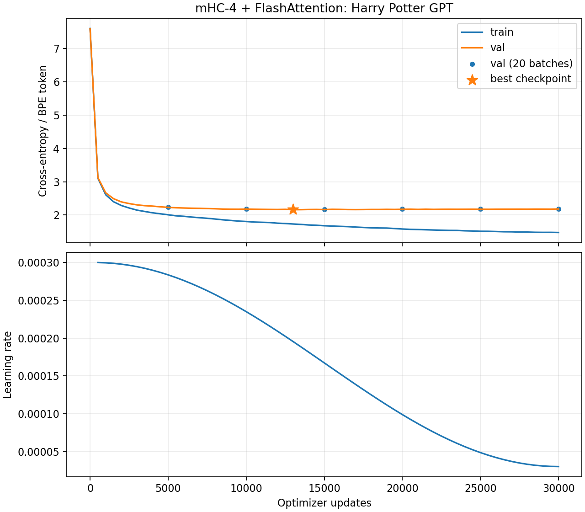

# mHC residual streams + fused FlashAttention on the toy GPT

This experiment combines two independent changes to our Chapter 5 Harry Potter
language model. [Manifold-constrained hyper-connections (mHC)](https://arxiv.org/abs/2512.24880)
change **how residual information flows between layers**. The
[FlashAttention](https://arxiv.org/abs/2205.14135) backend changes **how the
same causal attention operation is scheduled on the GPU**. Flash does not
change the attention equation or add residual streams.

## What is implemented

`my_gpt.py` keeps the original model as the default. With `mhc_streams=4`,
each token's hidden state is copied into four `[d_model]` streams. Attention
and SwiGLU are each separate routed residual sublayers:

```
selected        = Σ_j H_pre[j] · stream[j]
updated         = Attention_or_SwiGLU(RMSNorm(selected))
next_stream[i]  = Σ_j H_res[i,j] · stream[j] + H_post[i] · updated
```

The routing coefficients come from an RMS-normalized, flattened **single
token's** four streams. They never mix sequence positions, so the routing
network cannot read a future token. `H_pre = sigmoid(raw_pre)`,
`H_post = 2 sigmoid(raw_post)`, and `H_res` is a nonnegative 4×4 matrix after
64 alternating row/column Sinkhorn normalizations in FP32. The coefficient
projection has learnable scale initialized to 0.01. Static routing biases
start with uniform `H_pre` and unit `H_post`. Residual logits are smoothly
bounded by `2*tanh(raw/2)` before Sinkhorn, then the resulting doubly-stochastic
matrix is blended with the identity using a learned mix weight initialized to
0.3. The initial `H_res` has about 0.91 diagonal mass. This stabilization
was added after an interrupted trial showed that unbounded routing logits
made 20 Sinkhorn passes leave some row sums nearly one unit away from 1.
The final training script checks row-sum error at each evaluation and stops
if it reaches 1e-3. At the end, the four streams are summed before the final
RMSNorm and tied vocabulary head. This is an intentionally small,
paper-inspired **stabilized** mHC implementation. The fixed-shape Sinkhorn
loop uses `torch.compile` on GPU; the remaining routing uses PyTorch
operations rather than the paper's custom fused mHC kernels.

An A100 microbenchmark of a `[32,128,4,4]` Sinkhorn tensor with 64 passes
measured 11.69 ms per eager forward/backward versus 5.82 ms compiled (after
about 39 seconds of one-time compilation). The whole-model training step
returned to roughly 0.09 seconds after compilation. These are measurements
of this tiny workload, not a general FlashAttention or mHC speed claim.

`attention_impl="flash"` calls PyTorch
`scaled_dot_product_attention(..., is_causal=True)` inside a context that
allows **only** the FlashAttention backend. If the GPU, shape, or dtype
cannot use that kernel, the run raises an error rather than silently falling
back. The A100 profiler recorded `aten::_scaled_dot_product_flash_attention`
and `pytorch_flash::flash_fwd_kernel` on the first validation batch.

## Training protocol

The run starts with fresh weights because a conventional single-stream GPT
checkpoint cannot supply the new routing parameters. It uses the existing
seven-book, 2,048-token BPE corpus and fixed train/validation split. Model:
four blocks, width 256, four attention heads, context 128, batch 32,
RMSNorm, SwiGLU, learned position embeddings, dropout 0.1, BF16 autocast,
fused AdamW with weight decay 0.1 on matrix weights, and gradient clipping
at 1.0. The LR warms up for 300 updates to 3e-4 and then cosine-decays to
3e-5 at update 30,000. The schedule is global across time-capped Modal A100
chunks. Each resume restores model, optimizer, CPU/CUDA RNG, and batch-sampler
RNG state. The script checkpoints at every 5,000 updates and logs fixed-window
train/validation losses every 500.

Relevant files:

- [`my_gpt.py`](../05_your-gpt-from-a-blank-file/my_gpt.py) — mHC route and Flash SDPA switch.
- [`modal_gpt_mhc_flash.py`](../05_your-gpt-from-a-blank-file/modal_gpt_mhc_flash.py) — fresh/resumable A100 training.
- [`modal_gpt_mhc_decode.py`](../05_your-gpt-from-a-blank-file/modal_gpt_mhc_decode.py) — fixed-prompt milestone decoding and 20-batch validation.
- [`test_my_gpt_mhc_flash.py`](../05_your-gpt-from-a-blank-file/tests/test_my_gpt_mhc_flash.py) — routing equation, Sinkhorn, gradients, SDPA equivalence, and causality.

The short CPU tests include an extreme-logit stress test for the mHC routing
constraint. At context 128, FlashAttention's quadratic score matrix would
already be small; this experiment verifies the fused GPU path, not a
long-context memory advantage.

## 30,000-step result

The full run completed in about 42.6 minutes of cumulative GPU training
time. Peak allocated VRAM was 1.12 GB. The maximum recorded row-sum error
for `H_res` across the 500-step evaluations was 1.2e-5; column error was
near FP32 rounding noise. The four streams begin identical but develop
different activation RMS values after the routed sublayers.

All checkpoints below were re-evaluated on the **same 20 fixed validation
batches** (seed 101), with dropout disabled. Perplexity is `exp(val loss)`
per BPE token.

| Checkpoint | Val loss | Perplexity |
|---:|---:|---:|
| 5,000 | 2.2355 | 9.351 |
| 10,000 | 2.1844 | 8.885 |
| **best, 13,000** | **2.1688** | **8.748** |
| 15,000 | 2.1694 | 8.753 |
| 20,000 | 2.1780 | 8.829 |
| 25,000 | 2.1807 | 8.853 |
| 30,000 | 2.1896 | 8.931 |



The final training loss was 1.476, while held-out loss was slightly worse
than at 13–15k. This is overfitting on our small, repetitive book corpus,
not a failed FlashAttention or routing calculation. The lowest-loss
checkpoint is `best.pt` (step 13,000), but the preferred checkpoint for
free-form generation may differ; compare `step_25000.pt` and
`step_30000.pt` before choosing one for that use.

The 25k and 30k samples can read more naturally than the 13k and 15k samples,
even though their validation losses are higher. For example, the later
`Harry looked at` continuations flow into dialogue more smoothly, while the
13k continuation becomes awkward after a few lines. All checkpoints still
produce semantic errors and occasional malformed phrases. The milestone
outputs in `milestone_decode.json` use the same three prompts, temperature
0.8, and seeds, but three short generations cannot establish a reliable
quality ranking. Lower next-token loss does not guarantee better perceived
fluency in a small sample. If choosing an autocomplete checkpoint now,
`step_25000.pt` is a **provisional** pick: the later samples were preferred
in informal review, and 25k retains slightly lower 20-batch validation loss
than 30k (2.1807 versus 2.1896). This is not a human-rated benchmark result.

The earlier 30k conventional residual **LayerNorm+SwiGLU** model reached
validation loss 2.1880 / PPL 8.917 on the same 20-batch evaluation scheme.
Our mHC final checkpoint (2.1896 / 8.931) is essentially tied, while its
best earlier checkpoint is a little better. This is **not a controlled mHC
ablation**: normalization, model size (3.91M vs 3.71M parameters), and LR
schedule differ. FlashAttention computes the same attention result with a
different GPU schedule, so these quality differences should not be
attributed to the Flash kernel.

### Full validation pass

We also scored 294,656 of the 294,701 validation tokens in non-overlapping
128-token windows, rather than sampling 20 random batches. The last 45 tokens
do not fill a complete window and were omitted equally for every model.

| Checkpoint | Full-val loss | Full-val perplexity |
|---|---:|---:|
| mHC best, 13k | **2.1830** | **8.873** |
| mHC 15k | 2.1846 | 8.887 |
| mHC 30k | 2.2068 | 9.086 |
| conventional LayerNorm+SwiGLU, 30k | 2.1993 | 9.019 |

This confirms that longer mHC training hurt held-out loss, while the best
earlier mHC checkpoint scored slightly better than the earlier conventional
run. It does not establish that the 13k checkpoint gives the best subjective
generations. There is **no independent test set**: validation was already
used to select the best checkpoint, so even this full pass is not an unbiased
final generalization estimate. See `modal_gpt_full_validation.py` and
`full_validation.json` for the exact evaluation.

### Open-ended generation evaluation

`../05_your-gpt-from-a-blank-file/open_generation_eval.py` and
`../05_your-gpt-from-a-blank-file/modal_open_generation_eval.py` compare 13k,
15k, 25k, and 30k with the same 12 prompts, two sampling seeds per prompt,
128 generated BPE tokens, and temperature 0.8. The Modal script runs the
checkpoints on an A100 and writes `generations.json`, `automatic_scores.json`,
`blind_pairs.md`, `ratings.csv`, and a separate `blind_key.json` under the
run's `open_generation_eval/{prompts}p_{seeds}s_{tokens}t/` directory. The
local script can also run with
`generate --device cpu`, or rebuild scores and blind sheets from saved
generations. A blinded reader fills the ratings CSV and runs `summarize` to
obtain pairwise win shares and criterion ratings. Blank ratings explicitly
mean **no human judgment has been collected**.

From the Chapter 5 project directory, run the full protocol with:

```bash
/Users/abhinavverma/Desktop/qwen-tts-lab/scripts/modal-tts run modal_open_generation_eval.py --prompts 12 --seeds 2 --new-tokens 128 --temperature 0.8
python open_generation_eval.py summarize --ratings outputs/my_gpt_2048/modal_runs/gpt-mhc-flash-stable-30k/open_generation_eval/12p_2s_128t/ratings.csv
```

The second command is meaningful only after a person fills in the ratings.

Automatic measures are reported separately: lexical distinct-2/3/4 and
repeated 4-gram fraction flag diversity/loops; exact 20-BPE-token training
overlap flags potential copying. These are diagnostics, not a scalar quality
score. Common phrases can match training text without proving memorization,
and high distinct-n can reflect nonsense. Fluency, scene coherence, character
consistency, and prompt fit remain blind human ratings. Multiple seeds matter
because identical random seeds do not force different checkpoints to draw
comparable words from different probability distributions. The prompt set is
small and partly hand-written; it is a useful local comparison, not a
general-purpose benchmark or independent test set.

This design follows the evidence that decoding can change quality at fixed
model likelihood ([Holtzman et al.](https://arxiv.org/abs/1904.09751)), that
open-ended generation has distinct quality/diversity/consistency axes
([Nguyen](https://arxiv.org/abs/2108.03578)), and that human pairwise and
multi-criterion evaluation answer questions reference overlap alone cannot
([Stanford HELM Instruct](https://crfm.stanford.edu/2024/02/18/helm-instruct.html)).
Distinct-n is a standard lexical diversity diagnostic
([Li et al.](https://aclanthology.org/N16-1014/)); it is not a fluency score.
The overlap screen is motivated by evidence that language models can emit
verbatim training passages
([Carlini et al.](https://arxiv.org/abs/2202.07646)).

Artifacts: `outputs/my_gpt_2048/modal_runs/gpt-mhc-flash-stable-30k/` under
the Chapter 5 project contains all six milestone checkpoints, `best.pt`,
`metrics.jsonl`, `milestone_decode.json`, `full_validation.json`, and
`loss_and_lr.png`. The same
checkpoints and logs are committed to the `under-the-hood-gpt-a100` Modal
Volume under the run ID `gpt-mhc-flash-stable-30k`.

## Inference export

The original `best.pt` contains model weights **plus** AdamW state, RNG
state, config, and step for exact training resume. The best 13k model is
also exported locally as `best_model.safetensors` (15.7 MB versus 45 MB for
the full `.pt`), alongside `best_model_config.json` and
`best_model_tokenizer.json`. [`export_mhc_safetensors.py`](../05_your-gpt-from-a-blank-file/export_mhc_safetensors.py)
uses `safetensors.torch.save_model`/`load_model` because the token embedding
and output head share a weight matrix. It verified every loaded tensor and
fixed-prompt logits exactly. The three export files are also in the same
Modal Volume run directory. Future runs of `modal_gpt_mhc_flash.py` will
save the weight-only `best_model.safetensors` whenever `best.pt` improves.
The [safetensors shared-tensor documentation](https://huggingface.co/docs/safetensors/main/torch_shared_tensors)
explains why `save_model` is needed for tied weights.
