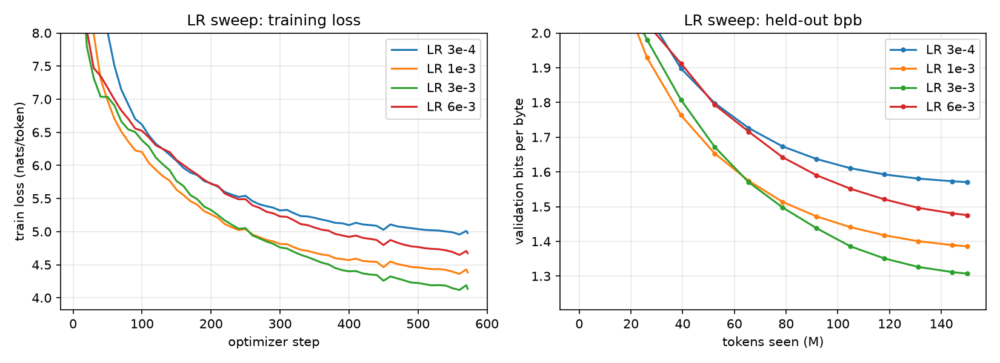
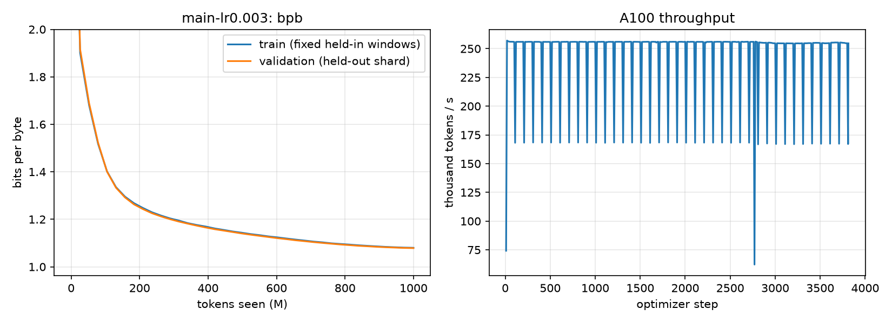
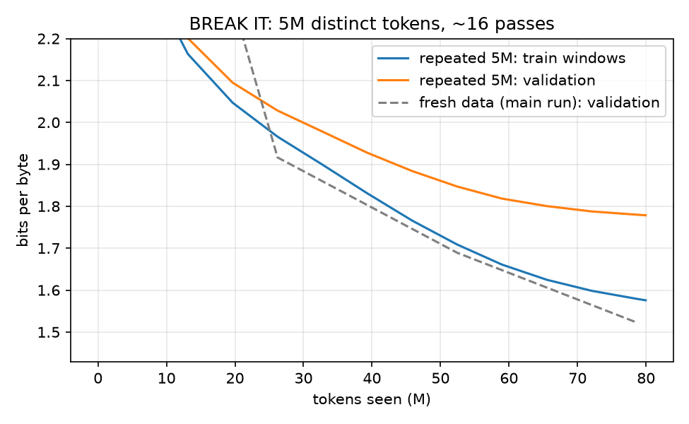

# Our Chapter 9 notes — pretraining on real web text

> My follow-along for Chapter 9 of *Under the Hood* ([buy the book](https://leanpub.com/under-the-hood)). The chapter's point: once you leave a single text file, the model code is the easy part. The work is the pipeline around it. It has to keep the GPU busy with clean data, measure progress honestly, and pick a learning rate by evidence.
>
> We built that pipeline around our own Chapter 5 GPT ([`my_gpt.py`](../05_your-gpt-from-a-blank-file/my_gpt.py)) and trained it on 1 billion tokens of [FineWeb-Edu](https://huggingface.co/datasets/HuggingFaceFW/fineweb-edu) on one A100.

## What we built

| File | What it does |
|---|---|
| [`pretrain_data.py`](pretrain_data.py) | GPT-2 tokenization with `<\|endoftext|>` after every document, the shard writer, the memory-mapped loader, and the bits-per-byte helpers |
| [`prepare_fineweb.py`](prepare_fineweb.py) | Streams FineWeb-Edu (or local text files), tokenizes once, and writes `uint16` shards plus `manifest.json` |
| [`pretrain.py`](pretrain.py) | Training loop: gradient accumulation, BF16 autocast, FlashAttention, `torch.compile`, validation bpb, tokens/s and MFU logging, time-capped resume |
| [`modal_pretrain.py`](modal_pretrain.py) | Modal entry points: `prepare`, `smoke`, `sweep`, `train`, `breakit`, `sample` |
| [`plot_runs.py`](plot_runs.py) | Figures from `metrics.jsonl` |
| [`tests/test_pretrain.py`](tests/test_pretrain.py) | Shard round trip and EOT count, loader shift and determinism, byte table and bpb, grad accumulation equals one big batch, resume equals an uninterrupted run, the BREAK IT slice limit |

## 1. Data: tokenize once, shard, memory-map

- **Source.** We streamed the `sample-10BT` subset of FineWeb-Edu and kept only the `text` field. We stopped after **1.10 B tokens**, which is **1,067,008 documents** at an average of 1,031 tokens each. Streaming meant we never downloaded the full 10 B-token sample. Eight Modal CPUs tokenized everything in **6.6 minutes** (~2.2 M tokens/s with `tiktoken`'s threaded batch encoder).
- **Tokenizer.** GPT-2 BPE (50,257 tokens), so every ID fits in a `uint16`: 2 bytes per token, and 1.1 B tokens take 2.2 GB on disk. The model's vocabulary is padded to **50,304**, a multiple of 64, so the output-layer matmul tiles evenly on the GPU. The 47 extra IDs never appear in the data.
- **Document boundaries.** `<|endoftext|>` follows every document. Without it, the model would be trained to predict the start of an unrelated web page from the end of the previous one. That is label noise.
- **Shards.** The first shard (10 M tokens) is the **validation split**. The next 11 shards (~100 M tokens each) are training data. Validation documents are never trained on.
- **Memory mapping.** `np.memmap` opens a shard without reading it. A batch touches only 16 windows of 1,025 tokens, and the operating system pages in only those bytes. The loader never holds a whole shard in RAM.
- **Bytes per token.** FineWeb-Edu text averages **4.62 UTF-8 bytes per GPT-2 token**. That ratio is what links loss per token to bits per byte.

## 2. Model and training setup

| Setting | Value |
|---|---|
| Model | Our `my_gpt.GPT`: 8 layers, width 512, 8 heads, context 1,024, RoPE, RMSNorm, SwiGLU, tied embeddings |
| Parameters | **50.9 M** (25.8 M of them in the tied embedding / output matrix) |
| Attention | Fused FlashAttention through PyTorch SDPA (Chapter 8) |
| Batch | **262,144 tokens per update** = 16 sequences × 1,024 tokens × **16 accumulation steps** |
| Optimizer | AdamW, β = (0.9, 0.95), weight decay 0.1 on matrices only (Chapter 6 groups), grad clip 1.0 |
| Schedule | Linear warmup, then cosine decay to 10% of peak LR |
| Precision | BF16 autocast, FP32 master weights, `torch.compile` |
| Hardware | One A100-SXM4-40GB on Modal |

**Gradient accumulation.** Only 16 sequences fit in one forward pass comfortably: the `16 × 1024 × 50304` logits alone are 1.6 GB in BF16. So we run 16 micro-batches, divide each loss by 16, and step the optimizer once. The test `test_grad_accumulation_equals_big_batch` checks that this gives the same gradient as one 16× larger batch.

**Throughput.** The run held a steady **~256 K tokens/s**. That is about **29% MFU** (model FLOPs utilization), counting `6 × params + 12 × layers × width × context` FLOPs per token against the A100's 312 TFLOP/s BF16 peak. The rest goes to things like the softmax over a 50 K vocabulary, normalization, the optimizer, and kernel launches. A 51 M model is small enough that these overheads matter.

## 3. Bits per byte

Loss per token depends on the tokenizer: a tokenizer with longer tokens makes fewer, harder predictions. **Bits per byte** removes that dependence:

```
bpb = Σ (cross-entropy in nats over text targets) / (ln 2 × Σ UTF-8 bytes of those targets)
```

We precompute the byte length of all 50,257 tokens once. `<|endoftext|>` targets count as zero bytes, and their loss is left out too, because they are not text. Every evaluation uses the **same fixed windows**: the first 1 M tokens of the validation shard, plus 1 M held-in tokens from the first training shard. That makes points on a curve comparable. Here, `val_loss / val_bpb` ≈ 3.22, close to `ln 2 × 4.62 bytes/token` = 3.20. It is not exact because EOT targets are excluded from bpb, and the validation windows' bytes per token differ slightly from the corpus average.

## 4. Learning-rate sweep

Four runs, identical except for the peak LR. Each ran 150 M tokens (572 updates, 100 warmup) on its own A100, in parallel.



| Peak LR | val bpb at 150 M tokens | Train − val gap |
|---|---|---|
| 3e-4 | 1.571 | 0.009 |
| 1e-3 | 1.386 | 0.002 |
| **3e-3** | **1.307** | −0.003 |
| 6e-3 | 1.476 | 0.005 |

What we learned:

- **It is a U-shape with a clear winner.** 3e-3 beat both neighbors by 0.08 and 0.17 bpb. That is far larger than any noise between evaluations.
- **Too high did not mean "explodes".** 6e-3 never spiked or produced NaNs. It just learned more slowly and stalled higher. "Unstable" is not the only way a bad LR shows up.
- **The early leader was not the winner.** Up to ~60 M tokens, 1e-3 was ahead of 3e-3. 3e-3 overtook it and kept widening the gap. Picking a winner from the first ~200 updates would have chosen wrong. The sweep has to run on the same schedule and a meaningful fraction of the budget.
- **Caveat.** A short sweep can favor a slightly higher LR than a long run would. We used 3e-3 for the 1 B-token run anyway, because it won by a wide margin.

## 5. Main run: 1 B tokens

Peak LR 3e-3, 200 warmup updates, cosine decay to 3e-4 over **3,814 updates (1.0 B tokens)**. Evaluation ran every 100 updates. That is about 20 tokens per parameter, the "Chinchilla" rule of thumb for a compute-efficient budget.



| Tokens seen | Val bpb | Train bpb (held-in) | Gap |
|---|---|---|---|
| 0 | 3.398 | 3.407 | −0.009 |
| 26 M | 1.916 | 1.901 | 0.015 |
| 131 M | 1.333 | 1.335 | −0.002 |
| 262 M | 1.212 | 1.216 | −0.004 |
| 524 M | 1.135 | 1.138 | −0.003 |
| 786 M | 1.094 | 1.096 | −0.002 |
| **1,000 M** | **1.079** | 1.080 | −0.001 |

What we learned:

- **Returns diminish fast.** The first 131 M tokens took val bpb from 3.40 to 1.33. The next 870 M tokens, 6.6× more compute, took it from 1.33 to 1.08. Both halves were worth doing, but each extra 0.01 bpb gets more expensive.
- **No overfitting, by construction.** The run drew 1 B tokens of random windows from 1.09 B training tokens, so on average each token was seen about once. The train and validation curves sit on top of each other (the gap stays under ±0.02). This is the healthy picture the chapter describes. Compare it with the BREAK IT gap below.
- **Stable training.** No loss jumps above 0.15 between logs. After warmup, the grad norm had a median of 0.15 and a max of 2.3, well within clipping range. The sweep's choice held up at 6.7× the budget: at 157 M tokens the main run's 1.292 matched the sweep's 1.307 at 150 M.
- **Resume worked.** Modal calls were capped at 50 minutes. The run paused at update 2,764 and resumed from the saved model, optimizer, and data-sampler RNG state. The curve has no seam. (The first resume attempt crashed: the checkpoint was loaded onto the GPU, and `torch.set_rng_state` needs a CPU tensor. The fix is to always load on CPU and let `load_state_dict` move tensors. The local resume test ran on CPU, so it could not catch this.)
- **Samples.** [`samples_main_1B.md`](samples_main_1B.md) has 8 unedited continuations. The model has clearly learned the *register* of educational web text: paragraphs, definitions, "for example", quotes from professors. But the content is confidently wrong. It writes about Einstein and the Big Bang in 1905, and says the French Revolution was "of 1839". One sample degenerates into a repeated `- "Vietnamese"` list. A lower bpb means better next-byte prediction. It does not mean facts or coherence.

## 6. BREAK IT: repeat a small slice of data

Same model, same LR (3e-3), and 80 M tokens of training. But every batch came from the **same first 5 M tokens** of the training data, so each token was seen about **16 times**. Validation stayed on the untouched held-out shard.



| Tokens seen | Passes over the 5 M | Train bpb (held-in) | Val bpb | Gap |
|---|---|---|---|---|
| 26 M | ~5 | 1.966 | 2.028 | 0.062 |
| 52 M | ~10 | 1.709 | 1.847 | 0.138 |
| 80 M | ~16 | 1.576 | 1.778 | **0.203** |

At equal tokens, the fresh-data main run was far ahead on validation: **1.916 vs 2.028** at 26 M, **1.689 vs 1.847** at 52 M, and **1.523 vs 1.780** at 79 M. By 79 M, BREAK IT's learning rate had decayed to its minimum, while the main run's was still near peak. That difference *favors* BREAK IT, and it still lost by 0.26 bpb. Repeating data does not just waste compute; it teaches less per token.

This is memorization in the chapter's sense. The model keeps getting better at text it has already seen, and much less so at new text. In our run, validation bpb **stalled** (1.788 → 1.778 over the last 20 M tokens) but did not yet turn upward. The rising gap is the alarm. In the main run, every token was new, and the gap stayed near zero throughout.

## 7. Cost and time

| Step | Hardware | Wall clock |
|---|---|---|
| Stream + tokenize 1.1 B tokens | 8 CPUs | 6.6 min |
| Smoke test (50 updates) | 1 × A100 | ~5 min |
| LR sweep, 4 × 150 M tokens | 4 × A100 in parallel | ~12 min |
| BREAK IT, 80 M tokens | 1 × A100 | ~6 min |
| Main run, 1 B tokens | 1 × A100 | ~70 min (two resumable chunks) |
| Samples | 1 × A100 | ~3 min |
| **Total GPU time** | | **~2.2 A100-hours** |

## Caveats

- One seed per configuration. The sweep's gaps are large, but we did not measure seed-to-seed spread.
- We streamed the first 1.1 B tokens of `sample-10BT` in order, not a shuffled sample. The validation shard is the first ~9.7 K documents.
- MFU uses the standard `6N` approximation. It is a rough utilization signal, not a profiler measurement.
- The FineWeb-Edu data and all checkpoints stay on a Modal volume. Only metrics, configs, and figures are in this repo.
