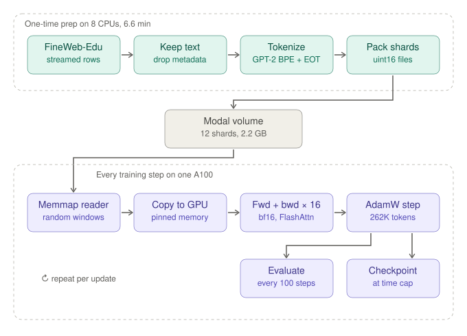
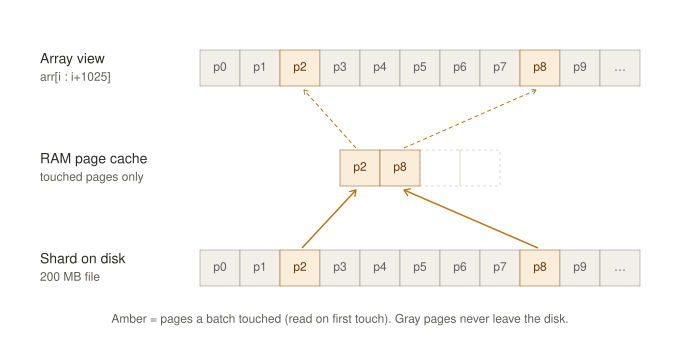

# Our pretraining pipeline, annotated like a systems engineer

> Chapter 9, Step 2 of *Under the Hood* ([buy the book](https://leanpub.com/under-the-hood)) asks you to annotate `prepare.py` "like a systems engineer". For every stage, write down four things: **Input, Operation, Output, and Why here**. The book's `prepare.py` is the one from [karpathy/autoresearch](https://github.com/karpathy/autoresearch) (see Chapter 20).
>
> This page does that exercise for **our own pipeline** ([`prepare_fineweb.py`](prepare_fineweb.py), [`pretrain_data.py`](pretrain_data.py), [`pretrain.py`](pretrain.py)), then compares it with autoresearch's `prepare.py`. Each stage also gets three more fields that a systems engineer cares about:
> - **Cost:** what we measured.
> - **Failure mode:** how the stage breaks.
> - **Verified by:** which test or check covers it.

## What "annotate like a systems engineer" means

A model engineer asks "what does this code compute?" A systems engineer asks:
- What *shape* of data enters and leaves each stage?
- Where do time and memory go?
- Why does this work happen *here* and not in another stage?
- What breaks, and how would I notice?

The point of the book's four fields is **placement**. Every piece of work in a training pipeline has a cheapest place to happen. Tokenizing inside the training loop means paying for it on every epoch, on the most expensive machine you own. Tokenizing once, on cheap CPUs, and storing integers means the GPU only ever reads numbers.

## The pipeline at a glance



<details>
<summary>Text version with numbers per stage</summary>

```
 ┌──────────────────────────── ONE-TIME PREP (8 CPUs, 6.6 min) ────────────────────────────┐
 │                                                                                          │
 │  HuggingFace FineWeb-Edu        ①  keep only       ②  GPT-2 BPE        ③  pack into      │
 │  sample-10BT (parquet,    ───▶     row["text"]  ───▶   + <|endoftext|> ──▶  uint16 shards  │
 │  streamed, never fully             drop URL,           per document        val first     │
 │  downloaded)                       score, ...          (2.2M tok/s)        (10M), then   │
 │                                                                            train (100M)  │
 │                                                                  │                       │
 │                                    ④ manifest.json ◀──────────────┘                       │
 │                                       tokens / docs / bytes per shard                    │
 │                                    ⑤ token byte table (50,304 × int, EOT = 0)            │
 └──────────────────────────────────────────┬───────────────────────────────────────────────┘
                                            │  Modal volume: 12 files, 2.2 GB
                                            │  (Chapter 10 side path: audit → dedup +
                                            │   decontaminate → same shard format)
 ┌──────────────────────────── EVERY TRAINING STEP (A100) ──────────▼────────────────────────┐
 │                                                                                          │
 │  ⑥ np.memmap shards ──▶ 16 random 1,025-token windows ──▶ ⑦ pinned host buffer ──▶ GPU   │
 │     (OS pages in only        (x = first 1,024, y = shifted by 1)     non_blocking copy    │
 │      touched bytes)                                                                       │
 │                                                                                          │
 │  ⑧ forward/backward in BF16 (FlashAttention, torch.compile)  × 16 micro-batches          │
 │     loss / 16 → gradients accumulate → clip → AdamW step      = 262,144 tokens / update  │
 │                                                                                          │
 │  ⑨ every 100 steps: fixed windows (val shard + 1st train shard) → loss, bits per byte    │
 │  ⑩ metrics.jsonl every 10 steps; latest.pt (model + optimizer + loader RNG) at time cap  │
 └──────────────────────────────────────────────────────────────────────────────────────────┘
          256K tokens/s · ~29% MFU · 93% of GPU time in training steps · 1 B tokens ≈ 70 min
```

</details>

## Stage by stage

### ① Keep only the text — [`prepare_fineweb.py:28`](prepare_fineweb.py:28)
| | |
|---|---|
| **Input** | Streamed dataset rows: `text`, plus URL, dump ID, language score, edu score, token count |
| **Operation** | `yield row["text"]` |
| **Output** | Plain text documents, in stream order |
| **Why here** | Metadata is never trained on. Dropping it first means no later stage stores, hashes, or moves it. |
| **Cost** | Bounded by download speed. The whole prep ran at ~2.2 M tokens/s, so the network kept up. |
| **Failure mode** | A network error mid-stream kills the job, and there is no retry. Restarting from scratch costs ~7 minutes. autoresearch retries each download 5 times and writes to `.tmp` files first. |
| **Verified by** | `test_shards_roundtrip_and_eot`: the first decoded document equals the original text |

### ② Tokenize + end-of-document token — [`pretrain_data.py:30`](pretrain_data.py:30)
| | |
|---|---|
| **Input** | A batch of 1,024 text documents |
| **Operation** | `encode_ordinary_batch(..., num_threads=8)`, then append `<\|endoftext\|>` (ID 50256) to each |
| **Output** | One `uint16` array per document |
| **Why here** | Tokenization is deterministic and expensive. Doing it once on cheap CPUs means the GPU never waits on string processing. The EOT marks where a document ends, so the model is never trained on a fake "document A's ending → document B's opening" transition. |
| **Cost** | ~2.2 M tokens/s on 8 threads. `encode_ordinary` ignores special-token text inside documents, so a web page containing the literal string `<\|endoftext\|>` cannot inject a boundary. |
| **Failure mode** | `uint16` holds IDs up to 65,535. GPT-2's largest ID is 50,256, so it fits, but a bigger vocabulary would silently wrap. There is no assert for this. |
| **Verified by** | Same test: EOT count == document count; decode(first doc) == original |

### ③ Pack into shards, validation first — [`pretrain_data.py:36`](pretrain_data.py:36)
| | |
|---|---|
| **Input** | A stream of token arrays |
| **Operation** | Copy into a preallocated buffer. When it is full, write it to disk with `tofile`: the first 10 M tokens as `val_0000.bin`, then 100 M-token `train_XXXX.bin` shards. A document may cross a shard boundary. |
| **Output** | 1 validation + 11 training shards, 2.2 GB total (2 bytes per token) |
| **Why here** | Fixed-size files are easy to memory-map, copy, and resume from. Writing validation first guarantees that no validation document is ever in a training shard. |
| **Cost** | Sequential disk writes, negligible |
| **Failure mode** | Validation is *document*-disjoint from training, not *content*-disjoint. Chapter 10 found 177 validation docs (1.8%) whose text reappears in training. |
| **Verified by** | Shard sizes and EOT count in `test_shards_roundtrip_and_eot`; content overlap measured in Chapter 10 |

### ④ Manifest — [`pretrain_data.py:75`](pretrain_data.py:75)
| | |
|---|---|
| **Input** | Per-shard counters |
| **Operation** | Write `manifest.json`: file name, split, tokens, documents, UTF-8 bytes per shard |
| **Output** | One small JSON file; our copy is [`outputs/fineweb_manifest.json`](outputs/fineweb_manifest.json) |
| **Why here** | The loader discovers shards from the manifest rather than by listing a directory. The byte counts let us check bytes per token (4.62) without re-reading the text. The manifest is written last, so a crashed prep leaves no manifest instead of a half-valid one. |
| **Failure mode** | Stale shard files from an earlier run in the same folder are ignored, which is the point, but they still take up disk. |

### ⑤ Token byte table — [`pretrain_data.py:84`](pretrain_data.py:84)
| | |
|---|---|
| **Input** | The tokenizer |
| **Operation** | The UTF-8 length of every token; EOT and the 47 padding IDs are 0 |
| **Output** | A 50,304-entry integer tensor, moved to the GPU once |
| **Why here** | Converting loss into bits per byte needs the bytes of every target token. A lookup table makes that one gather per eval batch. |
| **Verified by** | `test_token_bytes_and_bpb`: the bytes of an encoded sentence sum to the sentence's UTF-8 length |

### ⑥ Memory-mapped random windows — [`pretrain_data.py:93`](pretrain_data.py:93)
| | |
|---|---|
| **Input** | Shards on disk + a seeded NumPy RNG |
| **Operation** | For each of 16 rows: pick a shard, weighted by size, then a random start, and slice 1,025 tokens |
| **Output** | `x` = the first 1,024 tokens, `y` = the same window shifted by one |
| **Why here** | `np.memmap` maps the file without reading it. Each step touches ~16 × 2 KB per micro-batch, so RAM use stays flat no matter how big the dataset is. |
| **Cost** | Trivial next to the GPU: ~256 windows per second |
| **Failure mode** | Windows can start mid-document and span an EOT, and attention is not masked at the boundary. This is common practice, and autoresearch does the same inside its packed rows. |
| **Verified by** | `test_loader_windows_are_shifted_and_deterministic` (shift, determinism, RNG save/restore) |

### ⑦ Host → GPU copy — [`pretrain_data.py:125`](pretrain_data.py:125)
| | |
|---|---|
| **Operation** | `pin_memory()` then `.to("cuda", non_blocking=True)` |
| **Why here** | Page-locked host memory allows an asynchronous DMA copy. For ~130 KB batches (16 × 1,025 tokens as int64) it barely matters, but it is free. |

### ⑧ Training step — [`pretrain.py:90`](pretrain.py:90)
| | |
|---|---|
| **Input** | 16 micro-batches of 16 × 1,024 tokens |
| **Operation** | BF16 autocast forward (FlashAttention, `torch.compile`) → `(loss / 16).backward()` × 16 → clip at 1.0 → AdamW step |
| **Output** | Updated weights; 262,144 tokens per update |
| **Why here** | Only 16 sequences fit in one pass: the 16 × 1,024 × 50,304 logits alone are 1.6 GB. Accumulation gives the gradient of a 16× larger batch. |
| **Cost** | ~1.02 s per update, ~256 K tokens/s, ~29% MFU |
| **Verified by** | `test_grad_accumulation_equals_big_batch` |

### ⑨ Evaluation — [`pretrain.py:67`](pretrain.py:67)
| | |
|---|---|
| **Input** | The same 1 M validation tokens and 1 M held-in training tokens, every time |
| **Operation** | Per-token cross-entropy → drop EOT targets → nats ÷ (ln 2 × bytes) |
| **Output** | `val_loss`, `val_bpb`, `train_bpb_fixed` |
| **Why here** | Fixed windows make every point on the curve comparable. Evaluating the held-in windows too puts the train/validation gap on the same scale. |
| **Cost** | ~5 s per evaluation, ~5% of the run |
| **Verified by** | `test_token_bytes_and_bpb`, the step-0 loss ≈ ln(50,304), and a loss/bpb ratio that stays constant at 3.22 |

### ⑩ Metrics, checkpoint, resume — [`pretrain.py:152`](pretrain.py:152)
| | |
|---|---|
| **Operation** | Append JSON lines to `metrics.jsonl`. At the time cap, save model + optimizer + loader RNG + CPU RNG to `latest.pt.tmp`, then rename it (atomic) |
| **Why here** | Modal calls are time-capped, so the run must survive being cut at any step. |
| **Failure mode** | Found in production: loading the checkpoint with `map_location="cuda"` put the CPU RNG state on the GPU, and `torch.set_rng_state` crashed on resume. The fix is to always load on CPU. |
| **Verified by** | `test_resume_matches_uninterrupted_run`: identical weights after interrupt + resume |

## How `np.memmap` works (stage ⑥ in detail)

A **memory-mapped file** looks like an array that is fully in memory, but nothing is read from disk until the code actually uses it.



**Pages.** The operating system moves file data in fixed-size **pages**: 4 KB on Linux x86, 16 KB on Apple Silicon. One 100 M-token shard (200 MB) is about 48,800 pages of 4 KB.

**What happens, step by step:**
1. `np.memmap(path, dtype=np.uint16, mode="r")` makes an `mmap` system call. The OS records that these virtual addresses belong to this file. **No shard data is read.**
2. When code reads `arr[i : i+1025]` and copies it, the CPU touches an address whose page is not in RAM. That triggers a **page fault**, which is the normal mechanism here, not an error.
3. The OS reads **only that page** from disk into its **page cache** and maps it. Read-ahead may bring a few neighbouring pages too.
4. Later reads of the same page are served from RAM.
5. Under memory pressure, the OS simply drops these pages. They are backed by the file, so no swap is needed.

The page cache belongs to the OS, not to our Python object. Two processes, or two `np.memmap` objects on the same file, share one physical copy.

**When our code actually reads the file:**

| When | Code | Read from disk |
|---|---|---|
| Training starts | `ShardLoader.__init__` → `np.memmap(...)`, `len(a)` | **Nothing** except the ~2 KB `manifest.json` |
| Every micro-batch | `batch()` → `view.astype(np.int64)` ([`pretrain_data.py:120`](pretrain_data.py:120)) | 1–2 pages per 2 KB window; ~1 MB per 262 K-token update |
| First evaluation | `fixed_windows()` → `.astype(np.int64)` | ~2 MB validation + ~2 MB held-in |
| Later evaluations | same | ~0: the same pages are still in the page cache |

Slicing (`arr[a:b]`) only creates a view. The **copy** (`.astype`) is what touches pages. Whole-array operations such as `arr.sum()` or `(arr == EOT).sum()` touch every page, so memmap saves I/O only when each step reads a small part of the file.

**Pitfalls:**
- The `.bin` files have no header. Opening one with the wrong `dtype` gives garbage without an error. `np.save` plus `np.load(mmap_mode="r")` is the header-carrying alternative.
- `mode="r"` is read-only. `"r+"` writes back to the file, and `"c"` is copy-on-write.
- First-touch latency depends on the storage. We needed only ~1 MB/s, so the Modal network volume never slowed training.

**Beyond pretraining.** The same idea is standard in retrieval systems: graph-based vector indexes (Annoy is built around mmap), SQLite/FTS5 with `mmap_size`, chunk stores, and llama.cpp loading GGUF model weights. It pays off most when each query touches a small part of the file (graph index, keyword postings, top-k chunks). For full scans, such as flat vector search or LLM weights, the benefit is fast startup and reclaimable memory rather than less I/O.

## Compared with autoresearch's `prepare.py`

| | autoresearch `prepare.py` | Ours |
|---|---|---|
| Source | `karpathy/climbmix-400b-shuffle`, parquet shards **downloaded** with retries + `.tmp` files | FineWeb-Edu `sample-10BT`, **streamed**, no retries |
| Tokenizer | **Trains its own** BPE (`rustbpe`, vocab 8,192, GPT-4 split pattern) | Off-the-shelf GPT-2 BPE (50,257, padded to 50,304) |
| Document boundary | **BOS prepended** to every document | **EOT appended** to every document |
| When tokenization happens | **On the fly, inside the dataloader**, reading parquet text | **Once, before training**; the GPU reads `uint16` files |
| Packing | Best-fit packing: every row starts with BOS, documents placed whole where they fit, the last one cropped with the remainder **discarded**, no padding | Random 1,025-token windows over concatenated shards; may start mid-document |
| Cross-document attention mask | None | None |
| Validation | A pinned last shard (`shard_06542`) | The first 10 M tokens (a document-disjoint shard) |
| Eval size / context | `EVAL_TOKENS` = 20.9 M at `MAX_SEQ_LEN` = 2,048 | 1 M tokens at 1,024 |
| bpb formula | `total_nats / (ln 2 × total_bytes)`, special tokens have 0 bytes | Identical |
| Extras | Fixed 5-minute `TIME_BUDGET` per experiment | Dedup + contamination audit (Chapter 10), manifest with byte counts, resumable loader RNG |

The comparison has one surprise. **autoresearch does not pre-tokenize.** It tokenizes inside the dataloader. The book's step-2 annotations ("pack tokens into shard-sized arrays and write to disk") describe the pre-tokenized design, which is what we built, in the style of nanoGPT and modded-nanogpt. Both choices are defensible:
- autoresearch trains tiny models for 5 minutes with a fast Rust tokenizer, so tokenizing on the fly costs little and keeps prep simple.
- At our scale (1 B tokens, 70 minutes, one A100), paying for tokenization once, on 8 CPUs, keeps the expensive GPU from waiting.

## Have we done this?

| Item | Status |
|---|---|
| The book's three annotated stages (keep text → tokenize + EOT → pack shards) | ✅ Built, tested, and run on 1.1 B tokens in Chapter 9 |
| The book's literal exercise (annotate `prepare.py`) | ✅ This page, including the comparison with autoresearch's actual file |
| Memory mapping, grad accumulation, BF16, validation bpb, LR sweep | ✅ Chapter 9 ([`NOTES.md`](NOTES.md)) |
| Content-level train/validation separation | ✅ Measured and fixed in Chapter 10 (dedup + decontaminated shards) |
| Training our own tokenizer | ❌ We used GPT-2's |
| BOS-aligned packing (no mid-document starts) | ❌ Random windows |
| Download retries / resumable prep | ❌ A failed stream restarts the ~7-minute prep |
| A `uint16` overflow assert for larger vocabularies | ❌ Not needed for GPT-2, but worth adding before changing tokenizers |
