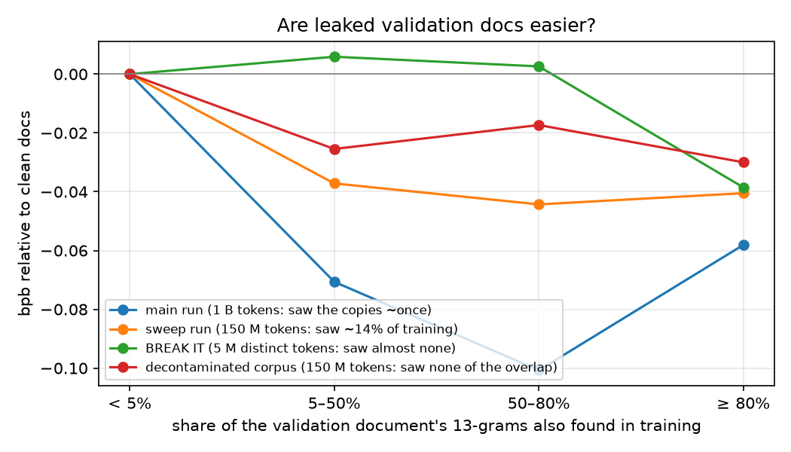

# Our Chapter 10 notes — auditing the data we actually trained on

> My follow-along for Chapter 10 of *Under the Hood* ([buy the book](https://leanpub.com/under-the-hood)). The chapter's claim: the four curation operations (quality filtering, deduplication, decontamination, mixing) are measurable quantities, not vibes.
>
> Instead of a fresh sample, we audited **the exact corpus our Chapter 9 model was trained on**: 1,067,008 FineWeb-Edu documents. The first 9,671 of them formed the validation shard. That turned the chapter's warning into a concrete question: *was our Chapter 9 validation number honest?*

## What we built

| File | What it does |
|---|---|
| [`curate.py`](curate.py) | Text normalization, Gopher-style quality stats and flags, MinHash signatures, LSH banding, union-find clustering, 13-gram hashing and index lookup, the mixing schedule |
| [`audit_corpus.py`](audit_corpus.py) | Two-pass multiprocess audit: validation 13-gram index, then every training doc's quality, exact hash, MinHash, and overlap with validation and benchmarks |
| [`modal_curate.py`](modal_curate.py) | Modal entry points: `audit` (16 CPUs), `decontaminate` (re-tokenize without the flagged docs), `val_eval` (per-document validation bpb for any checkpoints) |
| [`analyze.py`](analyze.py) | `val`: leak groups × checkpoints with bootstrap CIs, plus the figure. `mmlu`: classify benchmark hits |
| [`tests/test_curate.py`](tests/test_curate.py) | MinHash estimates true Jaccard, LSH clusters only near duplicates, 13-gram leak detection, an end-to-end audit on a corpus with planted problems, the mixing schedule |

The audit processed all 1.07 M documents in **4.5 minutes on 16 CPUs**.

## Two bugs before any results

**The book's MinHash crashes.** `mmh3.hash64` returns *signed* integers, so `np.fromiter(shingles, dtype=np.uint64)` raises `OverflowError` on the first document. Its `(a*x + b) % p` also wraps silently in `uint64`. With random 61-bit `a`, the wrapped values still mix well in practice, but they are no longer the `mod p` family the code claims.

**My first fix was worse, and the tests caught it.** To avoid overflow, I made `a, b < 2^32`. But then `a*x` wraps past `p` at most ~8 times, so the "random permutation" is almost linear in `x`. Every hash function picks nearly the same minimum shingle, and the 256 estimates stop being independent. On a pair with true Jaccard 0.42, MinHash said **0.57**. The final version uses **multiply-add-shift** hashing: `h(x) = ((a·x + b) mod 2^64) >> 32` with random 64-bit `a` (odd) and `b`. This family is *designed* for wrap-around arithmetic. With it, the same pair estimates **0.42**. `test_minhash_has_no_overflow_and_estimates_jaccard` checks this at several edit rates.

The end-to-end test also caught a counting bug. Benchmark items too short to have any 13-gram were missing from the item total. My original assertion had encoded the wrong number, so a planted-problem test with hand-checked expectations was worth writing.

## 1. Quality filtering: the heuristics mostly misfire here

| Flag (Gopher-style rule) | Training docs flagged |
|---|---|
| mostly bullet lines (> 90%) | 1,730 |
| too short (< 50 words) | 446 |
| repetitive (> 30% repeated 5-grams) | 95 |
| odd mean word length | 73 |
| few alphabetic words | 47 |
| non-ASCII > 20% | 36 |
| **any flag** | **2,409 (0.23%)** |

Reading the flagged examples in [`outputs/audit_examples_trimmed.json`](outputs/audit_examples_trimmed.json) changed the conclusion:
- A passage about Tacitus was flagged as bullets.
- A physics problem full of one-letter variables was flagged for word length.
- Short but real medical definitions were flagged as too short.

These rules were designed for raw Common Crawl. FineWeb-Edu has already passed an educational-quality classifier, so what remains is mostly legitimate. **We did not apply the quality filter.** Thresholds have to be calibrated on the corpus in front of you, by reading what they remove.

## 2. Deduplication: under 1% left

5-word shingles, 128 hashes, LSH with 16 bands × 8 rows, and pairs verified at estimated Jaccard ≥ 0.8.

| | Documents |
|---|---|
| Exact duplicates (after normalization) | 3,925 (0.37%) |
| Near duplicates, including exact ones (not the first copy in their cluster) | 5,890 (0.55%) |
| Largest cluster | 4 copies |
| Training docs that near-duplicate a validation doc | 147 |

FineWeb already ran MinHash dedup within each crawl dump. What remains are mostly the same article re-crawled in different dumps: a news story on weight-loss timing, a Keystone XL explainer. The book's 5–10% for curated corpora is an upper range; this one is cleaner.

## 3. Was our Chapter 9 validation set contaminated?

For each validation document, we measured the **share of its 13-grams that appear anywhere in training**:

| Share of 13-grams also in training | Validation docs | Share of validation text |
|---|---|---|
| < 5% | 8,401 | 88.9% |
| 5–50% | 1,012 | 8.5% |
| 50–80% | 81 | 0.7% |
| **≥ 80% (essentially the same document)** | **177 (1.8%)** | 1.9% |

The 177 are real copies: an article on the Renaissance and banking, a Nobel Prize history, the Cosmos 1 solar-sail launch. On the training side, 37,165 documents share at least one 13-gram with validation, and 6,725 share 50 or more.

**Did it inflate our number?** We scored every validation document separately with four checkpoints, then compared bpb on leaked docs with bpb on clean docs.

| Leak group | Main (1 B) | Sweep (150 M) | BREAK IT (5 M) | **Decontaminated (150 M)** |
|---|---|---|---|---|
| < 5% | 1.095 | 1.320 | 1.784 | 1.312 |
| 5–50% | 1.024 | 1.283 | 1.790 | 1.287 |
| 50–80% | 0.994 | 1.275 | 1.787 | 1.295 |
| ≥ 80% | 1.037 | 1.279 | 1.746 | 1.282 |

**First attempt, confounded.** We compared the main run, which saw the training copies, with BREAK IT, which saw almost none. The main run was 0.08–0.10 bpb better on the 5–80% groups, and the bootstrap CI excluded zero. That looks like strong memorization. But BREAK IT is a far weaker model (1.78 vs 1.09 bpb). A stronger model may simply exploit predictable text more, whether or not it has seen it.

**Controlled experiment.** We removed from training every document that shares **any** 13-gram with validation, plus near duplicates and benchmark hits: 43,033 documents (4.1%). The validation shard stayed byte-identical (SHA-256 checked). We then trained a model **identical to the 150 M-token sweep run**: same seed, LR, schedule, and budget. Now the only difference between the two runs is exposure to the overlapping text.

| Leak group | Extra gain from having seen the overlap (sweep − decontaminated) | 95% bootstrap CI | Confounded estimate (main − BREAK IT) |
|---|---|---|---|
| 5–50% | **+0.012 bpb** | [+0.009, +0.015] | +0.077 |
| 50–80% | **+0.027 bpb** | [+0.010, +0.040] | +0.103 |
| ≥ 80% | **+0.011 bpb** | [+0.002, +0.020] | +0.020 |

What we learned:
- **Leaked documents are intrinsically easier.** Even the decontaminated model, which never saw the overlap, scores them 0.02–0.03 bpb better than clean docs. Pages that get copied around the web tend to be predictable.
- **Memorization is real but small at one exposure.** Having seen the overlapping text about once helped by 0.01–0.03 bpb on those documents, and every CI excludes zero. No leaked document was memorized outright: the lowest per-document score among them is 0.65 bpb. (In Chapter 9's BREAK IT, 16 repeats did produce memorization.)
- **Our Chapter 9 number was essentially honest.** Dropping validation docs with ≥ 50% overlap moves the main run's validation bpb by **0.0017** (1.0869 → 1.0886). The strictest version, only docs under 5% overlap, gives 1.095. Most of that 0.008 difference is the intrinsic easiness above, not leakage.
- **The confounded comparison overstated memorization about 6×.** Without the controlled retrain, we would have written a much scarier and wrong conclusion. When two runs differ in more than one way, their difference measures all of the ways.
- **Bonus, single seed:** the decontaminated model was *better* on clean validation docs (1.312 vs 1.320) with 4% fewer, deduplicated documents at the same compute. This is consistent with duplicates wasting compute, but one seed cannot rule out noise at this size.

## 4. Benchmarks: MMLU and ARC

13-grams over the question plus all answer choices (normalized words):

| Benchmark | Items | Checkable (≥ 13 words) | Items with any 13-gram hit |
|---|---|---|---|
| MMLU (test) | 14,042 | 13,805 | 146 (1.0%) |
| ARC-Challenge (test) | 1,172 | 1,156 | 1 |
| ARC-Easy (test) | 2,376 | 2,299 | 4 |

A 13-gram hit is not the same as a leaked answer. Of the 146 MMLU items ([`outputs/mmlu_hits_classified.json`](outputs/mmlu_hits_classified.json)):
- **51 are quoted passages.** History questions quote the Declaration of Independence, Abigail Adams' "Remember the Ladies" letter, or an immigration act. Those primary sources are all over the web, so the overlap is the quote, not the question.
- **23 are strong leaks.** The question's actual ask appears in a training document, together with either the correct answer or at least half of the item's 13-grams. These are mostly practice-quiz pages for astronomy, geography, psychology, and statistics. That is **0.16% of MMLU**.

We removed all 649 hit documents in the decontaminated corpus anyway. A 51 M model will not score above chance on MMLU, so we did not measure a benchmark effect. The audit's value is knowing the leak rate before a larger model gets evaluated.

## 5. Mixing

`curate.mixing_weights` implements the book's schedule: 85/10/5 web/code/math, then a linear ramp to 55/30/15 over the last 20% of training. `curate.sample_sources` picks each sequence's source from those weights, and the test checks the sampled proportions. We did **not** train with it. Our corpus has one domain, and a mixing experiment needs separate code and math sources (for example The Stack and OpenWebMath).

## Cost and time

| Step | Hardware | Wall clock |
|---|---|---|
| Audit 1.07 M docs (run twice while refining the benchmark output) | 16 CPUs | 4.5 min each |
| Build decontaminated shards (1.02 B tokens) | 8 CPUs | ~7 min |
| Decontaminated 150 M-token training run | 1 × A100 | ~12 min |
| Per-document validation scoring, 4 checkpoints | 1 × A100 | ~4 min |

## Caveats

- One seed per training run. The memorization CIs come from resampling documents, not training seeds.
- "Leak" is 13-gram overlap on normalized words. Paraphrases and translations are invisible to it.
- Validation docs are grouped by overlap measured against the *original* corpus, for every model.
- The MMLU "strong leak" rule is a heuristic (question-ending present, plus the answer or ≥ 50% overlap). The 23 were checked by reading examples, not all 146.
